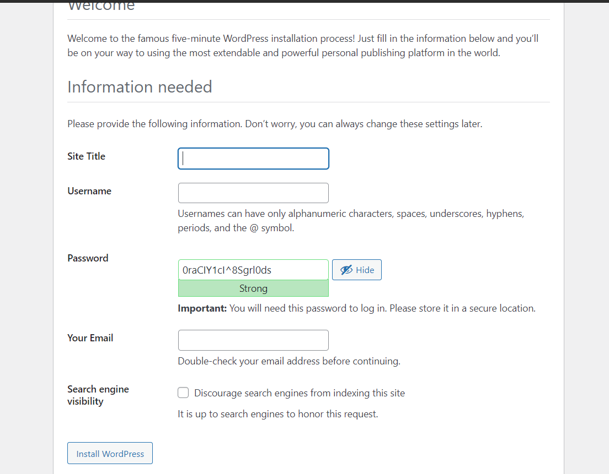

# Terraform with docker-compose
</br>

Before running this code you should have the following softwares installed:

- [Terraform](https://learn.hashicorp.com/tutorials/terraform/install-cli)
</br>

In the [main.tf](main.tf) file you must define the keypars of your instance, you can create your keypairs in AWS
</br>

 `key_name               = "lab-ansible"`
</br>

Its  important to define your credentials before running, in this case I'm using aws provider, you can take a look at 
[AWS Authentication](https://registry.terraform.io/providers/hashicorp/aws/latest/docs#authentication)
</br>

---
</br>
After have your terraform installed you can run:
</br>
</br>


```
terraform init 
```

```
terraform plan
```

```
terraform apply
```

---

You can see the deployment of your containers acessing your instance ip
> http://*your.instance.public-ip*:80
---
</br>

Then you will have:



After testing your application you can run:
</br>

```
terraform destroy
```
You can also see the docker-compose content in the [wpdb.yaml](wpdb.yaml) file